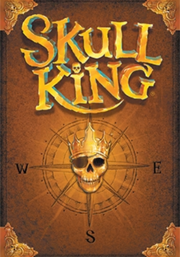

# Skull King bots

**Python implementation of the Skull King card game, with bots**

<div style="text-align: center;">
  
  
  
  
</div>

## Introduction

This is a Python implementation of the Skull King card game, with bots. The project aims to provide a simple and easy-to-understand implementation of the game, with the possibility to play against bots. Feel free to use this project to create your own bots, or to play the game.

The game rules are based on the official rules of the game, which can be found [here](https://www.grandpabecksgames.com/pages/skull-king).

## Installation

To install the project, you can clone the repository and install the requirements using pip:

```bash
git clone
cd skull-king-bots
```

**Python version:** The project requires `Python 3.10` or higher. Make sure you have the correct version installed before creating the virtual environment.

It is highly recommended to use a virtual environment to install the requirements. The virtual environment can be created using the following commands:

```bash
python -m venv venv
source venv/bin/activate
```

**Note:** The commands above are for Unix-based systems. For Windows, the commands are slightly different:

```bash
python -m venv venv
venv\Scripts\activate
```

Then, you can install the requirements using pip:

```bash
pip install -r requirements.txt
```

## Usage

To play the game, you can run the `main.py` script in the `src` directory:

```bash
python -m src.main
```